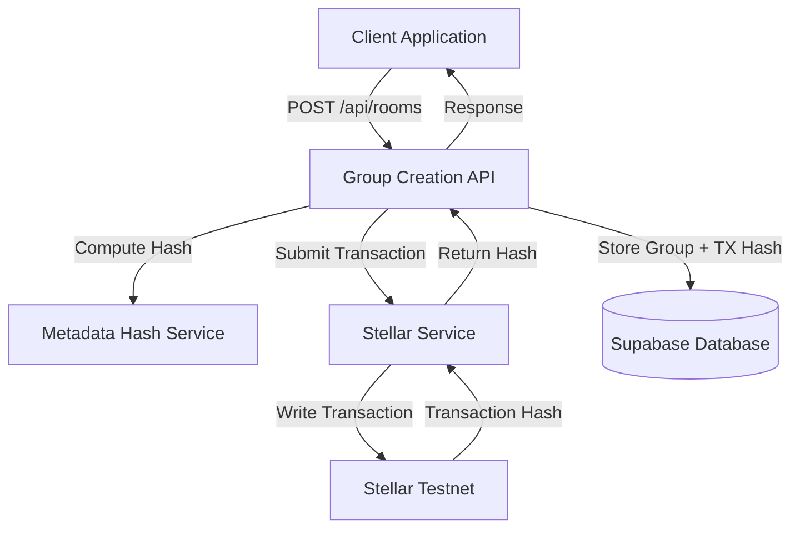

# Design Document: On-Chain Group Metadata Storage

## Overview

This design implements a blockchain-backed group creation system that stores cryptographic hashes of group metadata on the Stellar testnet. The solution provides transparency, auditability, and verifiable proof of group creation while maintaining system reliability through graceful degradation when blockchain operations fail.

The implementation extends the existing group creation API to include blockchain transaction submission, stores transaction hashes in the database, and provides verification endpoints for auditing purposes.

## Architecture

### High-Level Architecture



### Component Interaction Flow

1. Client submits group creation request
2. API validates request and creates group metadata object
3. Metadata Hash Service computes SHA-256 hash
4. Stellar Service submits transaction to testnet (async, non-blocking)
5. Database stores group record with transaction hash (or null if failed)
6. API returns success response to client

### Error Handling Strategy

The system uses a "best effort" approach for blockchain operations:
- Group creation always succeeds in the database
- Blockchain failures are logged but don't block user operations
- Transaction hash field accepts null values
- Timeout protection prevents hanging requests

## Components and Interfaces

### 1. Metadata Hash Service

**Purpose:** Generate deterministic cryptographic hashes of group metadata

**Interface:**
```typescript
interface MetadataHashService {
  computeHash(metadata: GroupMetadata): string;
  verifyHash(metadata: GroupMetadata, expectedHash: string): boolean;
}

interface GroupMetadata {
  id: string;
  name: string;
  description: string | null;
  created_by: string;
  created_at: string;
  is_private: boolean;
}
```

**Implementation Details:**
- Uses SHA-256 algorithm
- Serializes metadata to canonical JSON format (sorted keys)
- Returns hex-encoded hash string
- Deterministic: same input always produces same hash

### 2. Stellar Service

**Purpose:** Handle all interactions with Stellar blockchain

**Interface:**
```typescript
interface StellarService {
  submitMetadataHash(
    groupId: string,
    metadataHash: string
  ): Promise<StellarTransactionResult>;
  
  getTransaction(txHash: string): Promise<StellarTransaction | null>;
  
  isConfigured(): boolean;
}

interface StellarTransactionResult {
  success: boolean;
  transactionHash?: string;
  error?: string;
}

interface StellarTransaction {
  hash: string;
  memo: string;
  ledger: number;
  created_at: string;
}
```

**Implementation Details:**
- Uses `@stellar/stellar-sdk` for blockchain interaction
- Connects to Stellar testnet (configurable via environment)
- Creates payment transactions with memo field containing metadata hash
- Implements 30-second timeout for transaction submission
- Handles network errors gracefully
- Requires source account keypair from environment variables

### 3. Group Creation API Enhancement

**Purpose:** Extend existing `/api/rooms` endpoint with blockchain integration

**Enhanced Flow:**
```typescript
async function POST(request: NextRequest) {
  // 1. Existing validation and authentication
  // 2. Create group metadata object
  // 3. Insert group into database
  // 4. Compute metadata hash
  // 5. Submit to blockchain (async, with timeout)
  // 6. Update group record with transaction hash
  // 7. Return response with blockchain info
}
```

**Response Schema:**
```typescript
interface GroupCreationResponse {
  room: {
    id: string;
    name: string;
    description: string | null;
    is_private: boolean;
    created_by: string;
    created_at: string;
    stellar_tx_hash: string | null;
  };
  success: boolean;
  blockchain: {
    submitted: boolean;
    transactionHash?: string;
    explorerUrl?: string;
  };
}
```

### 4. Verification API

**Purpose:** Provide endpoint for verifying group metadata against blockchain

**Interface:**
```typescript
// GET /api/rooms/[id]/verify
interface VerificationResponse {
  groupId: string;
  currentMetadataHash: string;
  blockchainMetadataHash: string | null;
  transactionHash: string | null;
  verified: boolean;
  explorerUrl: string | null;
}
```

## Data Models

### Database Schema Changes

**Rooms Table Enhancement:**
```sql
ALTER TABLE rooms 
ADD COLUMN stellar_tx_hash TEXT NULL,
ADD COLUMN metadata_hash TEXT NULL,
ADD COLUMN blockchain_submitted_at TIMESTAMPTZ NULL;

CREATE INDEX idx_rooms_stellar_tx_hash ON rooms(stellar_tx_hash);
```

**Migration Strategy:**
- Existing groups will have null values for new fields
- New groups will populate fields when blockchain submission succeeds
- Nullable fields ensure backward compatibility

### Stellar Transaction Structure

**Transaction Type:** Payment (minimal amount)

**Transaction Components:**
- **Source Account:** System account (from environment config)
- **Destination:** Same as source (self-payment)
- **Amount:** 0.0000001 XLM (minimal)
- **Memo Type:** MEMO_TEXT
- **Memo Value:** Metadata hash (up to 28 bytes)
- **Network:** Testnet

**Rationale for Self-Payment:**
- Minimal cost (only base fee)
- Memo field available for hash storage
- No need for separate destination account
- Simple and reliable

## Correctness Properties

*A property is a characteristic or behavior that should hold true across all valid executions of a system—essentially, a formal statement about what the system should do. Properties serve as the bridge between human-readable specifications and machine-verifiable correctness guarantees.*

### Acceptance Criteria Testing Prework

1.1 WHEN a group is created, THE AnonChat System SHALL compute a SHA-256 hash of the group metadata
  Thoughts: This is a rule that should apply to all groups. We can generate random group metadata, call the hash function, and verify the output is a valid SHA-256 hash (64 hex characters).
  Testable: yes - property

1.2 WHEN the metadata hash is computed, THE AnonChat System SHALL submit a transaction to the Stellar testnet containing the hash
  Thoughts: This involves external network calls to Stellar. We can mock the Stellar SDK and verify it's called with correct parameters for any group metadata.
  Testable: yes - property

1.3 WHEN the Stellar transaction is submitted, THE AnonChat System SHALL include the metadata hash in the transaction memo field
  Thoughts: This is verifying that the transaction structure is correct. We can generate random metadata, mock the transaction builder, and verify the memo field contains the hash.
  Testable: yes - property

1.4 WHEN the Stellar transaction succeeds, THE AnonChat System SHALL receive a transaction hash from the Stellar network
  Thoughts: This is testing the integration with Stellar SDK. We can mock successful responses and verify the system extracts the transaction hash correctly.
  Testable: yes - property

1.5 WHEN the transaction hash is received, THE AnonChat System SHALL store the transaction hash in the database associated with the group record
  Thoughts: This is testing database operations. For any group and transaction hash, we should verify the database record is updated correctly.
  Testable: yes - property

2.1 IF the Stellar transaction fails, THEN THE AnonChat System SHALL log the error with relevant details
  Thoughts: This is testing error handling behavior. We can simulate various failure scenarios and verify appropriate logging occurs.
  Testable: yes - property

2.2 IF the Stellar transaction fails, THEN THE AnonChat System SHALL still complete the group creation in the database
  Thoughts: This is a critical resilience property. For any group creation request, even if blockchain fails, the group should exist in the database.
  Testable: yes - property

2.3 WHEN a blockchain transaction fails, THE AnonChat System SHALL store a null value for the transaction hash field
  Thoughts: This is verifying the database state after failure. For any failed blockchain operation, the stellar_tx_hash field should be null.
  Testable: yes - property

2.4 WHEN a blockchain transaction times out after 30 seconds, THE AnonChat System SHALL proceed with group creation
  Thoughts: This is testing timeout behavior. We can simulate slow network responses and verify the system doesn't hang.
  Testable: yes - example

2.5 IF the Stellar network is unavailable, THEN THE AnonChat System SHALL return a successful group creation response to the user
  Thoughts: This is testing graceful degradation. For any group creation, network unavailability shouldn't cause user-facing errors.
  Testable: yes - property

3.1 WHEN a group record contains a transaction hash, THE AnonChat System SHALL provide an API endpoint to retrieve the blockchain transaction details
  Thoughts: This is testing API behavior for groups with blockchain records. For any group with a transaction hash, the verification endpoint should return transaction details.
  Testable: yes - property

3.2 WHEN the blockchain transaction is retrieved, THE AnonChat System SHALL return the stored metadata hash from the transaction memo
  Thoughts: This is testing the verification flow. For any valid transaction hash, we should be able to extract and return the memo field.
  Testable: yes - property

3.3 WHEN comparing metadata, THE AnonChat System SHALL recompute the hash of current group metadata and compare it with the blockchain-stored hash
  Thoughts: This is a round-trip property. For any group with blockchain record, recomputing the hash should match the stored hash (assuming no tampering).
  Testable: yes - property

3.4 THE AnonChat System SHALL expose the transaction hash in the group creation API response
  Thoughts: This is testing API response structure. For any group creation, the response should include the transaction hash field.
  Testable: yes - property

3.5 THE AnonChat System SHALL include the Stellar testnet explorer URL in API responses for easy verification
  Thoughts: This is testing response formatting. For any transaction hash, the system should generate a valid explorer URL.
  Testable: yes - property

4.1 THE AnonChat System SHALL read Stellar network configuration from environment variables
  Thoughts: This is testing configuration loading. The system should read specific environment variables at startup.
  Testable: yes - example

4.2 WHERE the Stellar network is testnet, THE AnonChat System SHALL use testnet endpoints and credentials
  Thoughts: This is testing conditional configuration. When network is set to testnet, the system should use testnet-specific settings.
  Testable: yes - example

4.3 THE AnonChat System SHALL support configuration of the Stellar account used for submitting transactions
  Thoughts: This is testing configurability. The system should accept different account credentials via configuration.
  Testable: yes - example

4.4 THE AnonChat System SHALL validate that required Stellar configuration exists before attempting blockchain operations
  Thoughts: This is testing validation logic. For any blockchain operation, the system should check configuration first.
  Testable: yes - property

4.5 IF required Stellar configuration is missing, THEN THE AnonChat System SHALL log a warning and skip blockchain operations
  Thoughts: This is testing graceful degradation with missing config. The system should handle missing configuration without crashing.
  Testable: yes - example

5.1 WHEN a blockchain transaction is initiated, THE AnonChat System SHALL log the group ID and metadata hash
  Thoughts: This is testing logging behavior. For any transaction initiation, specific log entries should be created.
  Testable: yes - property

5.2 WHEN a blockchain transaction succeeds, THE AnonChat System SHALL log the transaction hash and confirmation details
  Thoughts: This is testing success logging. For any successful transaction, the system should log specific details.
  Testable: yes - property

5.3 WHEN a blockchain transaction fails, THE AnonChat System SHALL log the error type, message, and group context
  Thoughts: This is testing error logging. For any failure, the system should log comprehensive error information.
  Testable: yes - property

5.4 THE AnonChat System SHALL log the time taken for each blockchain operation
  Thoughts: This is testing performance logging. For any blockchain operation, duration should be logged.
  Testable: yes - property

5.5 THE AnonChat System SHALL include correlation IDs in logs to trace operations across system components
  Thoughts: This is testing log structure. For any operation, logs should include correlation identifiers.
  Testable: yes - property

### Property Reflection

After reviewing all properties, several can be consolidated:

**Redundancies identified:**
- Properties 1.2, 1.3, and 1.4 all test aspects of transaction submission and can be combined into one comprehensive property about transaction structure
- Properties 2.1, 2.2, and 2.3 all test failure handling and can be combined into one property about graceful degradation
- Properties 5.1, 5.2, 5.3, 5.4, and 5.5 all test logging and can be combined into fewer comprehensive logging properties
- Properties 3.1 and 3.2 both test the verification endpoint and can be combined

**Consolidated properties below:**

### Property 1: Hash computation determinism
*For any* group metadata object, computing the SHA-256 hash twice should produce identical results, and the hash should be a valid 64-character hexadecimal string.
**Validates: Requirements 1.1**

### Property 2: Transaction structure correctness
*For any* group metadata, when submitting to Stellar, the transaction should include the metadata hash in the memo field, use the configured source account, and target the testnet network.
**Validates: Requirements 1.2, 1.3**

### Property 3: Database persistence
*For any* group creation with successful blockchain submission, the database record should contain both the group data and the transaction hash in the stellar_tx_hash field.
**Validates: Requirements 1.5**

### Property 4: Graceful degradation on failure
*For any* group creation where blockchain submission fails, the group should still be created in the database with a null stellar_tx_hash value, and the API should return success.
**Validates: Requirements 2.2, 2.3, 2.5**

### Property 5: Verification round-trip
*For any* group with a stored transaction hash, retrieving the transaction from Stellar and comparing the memo hash with a recomputed hash of current metadata should match (assuming no tampering).
**Validates: Requirements 3.3**

### Property 6: API response completeness
*For any* group creation, the API response should include the group data, success status, and blockchain information (submitted status, transaction hash if available, explorer URL if available).
**Validates: Requirements 3.4, 3.5**

### Property 7: Configuration validation
*For any* blockchain operation attempt, if required Stellar configuration (network, source account secret) is missing, the system should skip blockchain operations without throwing errors.
**Validates: Requirements 4.4, 4.5**

### Property 8: Comprehensive logging
*For any* blockchain operation (success or failure), the system should log the group ID, metadata hash, operation duration, and outcome (transaction hash or error details).
**Validates: Requirements 5.1, 5.2, 5.3, 5.4**

## Error Handling

### Error Categories

1. **Configuration Errors**
   - Missing environment variables
   - Invalid Stellar account credentials
   - Action: Log warning, skip blockchain operations, proceed with group creation

2. **Network Errors**
   - Stellar network unreachable
   - Timeout after 30 seconds
   - Action: Log error, store null transaction hash, return success to user

3. **Transaction Errors**
   - Insufficient balance
   - Invalid transaction structure
   - Action: Log error with details, store null transaction hash, return success

4. **Database Errors**
   - Group insertion fails
   - Transaction hash update fails
   - Action: Return error to user (critical path)

### Error Response Format

```typescript
interface ErrorLog {
  timestamp: string;
  level: 'warn' | 'error';
  operation: string;
  groupId: string;
  error: {
    type: string;
    message: string;
    stack?: string;
  };
  context: Record<string, any>;
}
```

## Testing Strategy

### Unit Testing

We'll use **Jest** as the testing framework for unit tests, which is already commonly used in Next.js projects.

**Unit Test Coverage:**
- Metadata hash computation with various input combinations
- Stellar service configuration validation
- Transaction builder with different metadata inputs
- API endpoint request/response handling
- Error handling for specific failure scenarios
- Database operations (mocked)

**Example Unit Tests:**
- Empty group name handling
- Special characters in metadata
- Null description field handling
- Invalid Stellar configuration detection
- Transaction timeout simulation

### Property-Based Testing

We'll use **fast-check** as the property-based testing library for TypeScript/JavaScript.

**Configuration:**
- Minimum 100 iterations per property test
- Custom generators for group metadata
- Shrinking enabled for failure case minimization

**Property Test Requirements:**
- Each property test MUST include a comment tag: `**Feature: on-chain-group-metadata, Property {number}: {property_text}**`
- Each property MUST be implemented by a SINGLE property-based test
- Tests should use realistic data generators that respect business constraints

**Property Test Coverage:**
- Property 1: Hash determinism across random metadata
- Property 2: Transaction structure validation across random inputs
- Property 3: Database persistence verification
- Property 4: Graceful degradation with simulated failures
- Property 5: Verification round-trip with random groups
- Property 6: API response structure validation
- Property 7: Configuration validation with various missing configs
- Property 8: Logging completeness across operations

### Integration Testing

**Scope:**
- End-to-end group creation flow
- Stellar testnet interaction (using actual testnet)
- Database operations with test database
- API endpoint testing with supertest

**Test Environment:**
- Separate Stellar testnet account for testing
- Isolated Supabase test database
- Environment variable configuration for test mode

### Testing Execution Order

1. Unit tests (fast, no external dependencies)
2. Property-based tests (comprehensive input coverage)
3. Integration tests (slower, requires external services)

## Implementation Notes

### Dependencies

**New Dependencies Required:**
```json
{
  "dependencies": {
    "@stellar/stellar-sdk": "^12.0.0"
  },
  "devDependencies": {
    "fast-check": "^3.15.0",
    "jest": "^29.7.0",
    "@types/jest": "^29.5.0"
  }
}
```

### Environment Variables

```env
# Stellar Configuration
STELLAR_NETWORK=testnet
STELLAR_SOURCE_SECRET=S...
STELLAR_HORIZON_URL=https://horizon-testnet.stellar.org

# Optional: Override default timeout
STELLAR_TRANSACTION_TIMEOUT=30000
```

### Performance Considerations

- Blockchain operations run asynchronously to avoid blocking API responses
- 30-second timeout prevents hanging requests
- Database operations use transactions for consistency
- Caching not required (write-once operations)

### Security Considerations

- Source account secret stored in environment variables (never in code)
- Metadata hash prevents tampering detection
- Public blockchain provides transparency
- No sensitive user data in blockchain transactions
- Rate limiting on API endpoints (existing Next.js middleware)

### Monitoring and Observability

**Metrics to Track:**
- Blockchain submission success rate
- Average transaction confirmation time
- Error rate by category
- API response times

**Logging Strategy:**
- Structured JSON logs
- Correlation IDs for request tracing
- Error stack traces for debugging
- Performance timing for optimization

## Future Enhancements

1. **Mainnet Support:** Switch to Stellar mainnet for production
2. **Batch Transactions:** Submit multiple group hashes in single transaction
3. **Smart Contract Integration:** Use Soroban smart contracts for advanced logic
4. **Verification UI:** Frontend component to display blockchain verification status
5. **Webhook Notifications:** Alert on blockchain confirmation
6. **Historical Audit Trail:** Track all metadata changes on-chain
