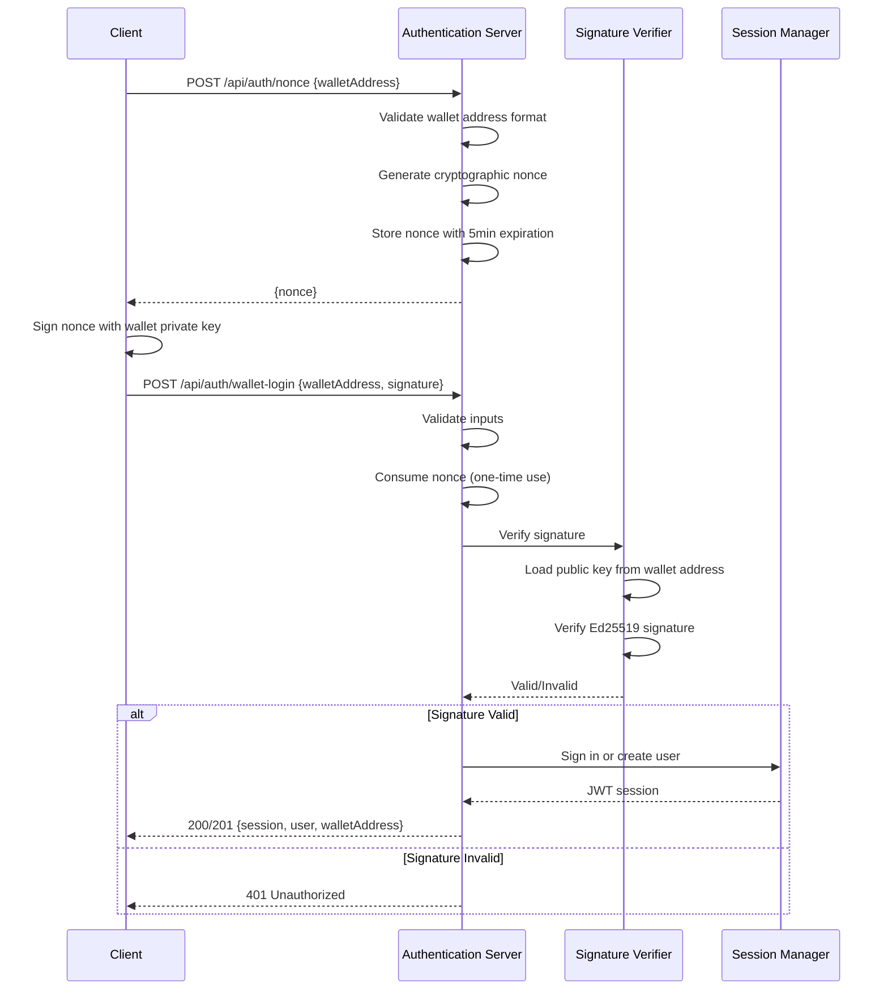
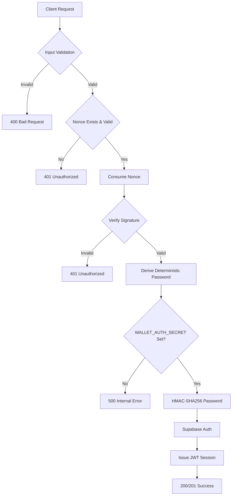

# Design Document: Wallet Signature Verification

## Overview

This design document specifies the architecture for implementing cryptographic wallet signature verification in the Next.js authentication system. The feature strengthens authentication by requiring users to prove wallet ownership through Ed25519 signature verification before session issuance.

The system builds upon the existing Stellar wallet integration and Supabase authentication infrastructure. It introduces a secure challenge-response flow where the server generates time-limited nonces, clients sign them with their wallet's private key, and the server verifies the signature before issuing JWT tokens.

### Key Design Goals

1. **Cryptographic Proof of Ownership**: Only users controlling the private key can authenticate
2. **Replay Attack Prevention**: Nonces are single-use and time-limited (5 minutes)
3. **Security Compliance**: HMAC-SHA256 password derivation, comprehensive input validation
4. **Minimal Changes**: Enhance existing `/api/auth/nonce` and `/api/auth/wallet-login` endpoints
5. **Production Ready**: Proper error handling, logging, and security monitoring

### Authentication Flow



## Architecture

### Component Structure

The implementation consists of four primary components:

1. **Signature Verifier** (`lib/auth/stellar-verify.ts`)
   - Cryptographic signature verification using Stellar SDK
   - Ed25519 algorithm implementation
   - Nonce generation and storage management
   - Nonce consumption and expiration validation

2. **Authentication Server** (`app/api/auth/`)
   - `/api/auth/nonce` - Nonce generation endpoint
   - `/api/auth/wallet-login` - Signature verification and session issuance endpoint
   - Input validation middleware
   - Error handling and logging

3. **Session Manager** (Supabase Integration)
   - JWT token issuance
   - User account creation and retrieval
   - Deterministic email/password generation from wallet addresses
   - Session persistence

4. **Nonce Storage** (In-Memory Map)
   - Key-value store: `walletAddress → {nonce, expiresAt}`
   - 5-minute TTL enforcement
   - Automatic cleanup on consumption
   - Single nonce per wallet address (replacement strategy)

### Security Architecture



### Technology Stack

- **Cryptography**: `@stellar/stellar-sdk` (Ed25519 signature verification)
- **Authentication**: Supabase Auth (JWT issuance, session management)
- **Runtime**: Next.js 16 API Routes (Edge Runtime compatible)
- **Storage**: In-memory Map (production: Redis/Supabase table recommended)
- **Password Derivation**: Web Crypto API (HMAC-SHA256)

## Components and Interfaces

### Signature Verifier Module

**Location**: `lib/auth/stellar-verify.ts`

**Exports**:

```typescript
/**
 * Generates a cryptographically random nonce for a wallet address.
 * Stores it with a 5-minute expiration. Replaces any existing nonce.
 * 
 * @param walletAddress - Stellar public key (56 chars, starts with 'G')
 * @returns Nonce string in format "anonchat:{timestamp}:{uuid}"
 */
export function generateNonce(walletAddress: string): string

/**
 * Retrieves and consumes a nonce for a wallet address.
 * Validates expiration and removes from storage (one-time use).
 * 
 * @param walletAddress - Stellar public key
 * @returns Nonce string if valid, null if not found or expired
 */
export function consumeNonce(walletAddress: string): string | null

/**
 * Verifies an Ed25519 signature using the Stellar SDK.
 * 
 * @param walletAddress - Stellar public key (56 chars, starts with 'G')
 * @param message - UTF-8 message that was signed (the nonce)
 * @param signature - Hex-encoded signature bytes
 * @returns true if signature is valid, false otherwise
 */
export function verifyWalletSignature(
  walletAddress: string,
  message: string,
  signature: string
): boolean
```

**Implementation Details**:

- **Nonce Format**: `anonchat:{timestamp}:{uuid}` ensures uniqueness and includes timestamp for debugging
- **Storage**: `Map<string, {nonce: string, expiresAt: number}>` with 5-minute TTL
- **Replacement Strategy**: New nonce generation replaces any existing nonce for the wallet
- **Signature Verification**: 
  - Uses `Keypair.fromPublicKey()` to load the public key
  - Uses `Keypair.verify()` for Ed25519 verification
  - Converts message to UTF-8 bytes, signature from hex to bytes
  - Catches all exceptions and returns false for invalid signatures

### Authentication API Routes

#### POST /api/auth/nonce

**Location**: `app/api/auth/nonce/route.ts`

**Request Body**:
```typescript
{
  walletAddress: string  // Stellar public key (56 chars, starts with 'G')
}
```

**Response**:
```typescript
// Success (200)
{
  nonce: string  // Format: "anonchat:{timestamp}:{uuid}"
}

// Error (400)
{
  error: "walletAddress is required" | "Invalid Stellar wallet address"
}

// Error (500)
{
  error: "Failed to generate nonce"
}
```

**Validation Logic**:
1. Check `walletAddress` is present and is a string
2. Validate Stellar format: exactly 56 characters, starts with 'G'
3. Generate and store nonce with 5-minute expiration
4. Return nonce to client

#### POST /api/auth/wallet-login

**Location**: `app/api/auth/wallet-login/route.ts`

**Request Body**:
```typescript
{
  walletAddress: string  // Stellar public key
  signature: string      // Hex-encoded signature of the nonce
}
```

**Response**:
```typescript
// Success - Existing User (200)
{
  session: Session        // Supabase session with JWT
  user: User             // Supabase user object
  walletAddress: string  // Confirmed wallet address
  isNewUser: false
}

// Success - New User (201)
{
  session: Session
  user: User
  walletAddress: string
  isNewUser: true
}

// Error (400)
{
  error: "walletAddress is required" | "signature is required"
}

// Error (401)
{
  error: "Nonce not found or expired. Request a new nonce." |
         "Signature verification failed. Wallet ownership not proved."
}

// Error (500)
{
  error: "Internal server error"
}
```

**Processing Pipeline**:
1. **Input Validation**: Verify `walletAddress` and `signature` are present
2. **Nonce Consumption**: Retrieve and delete nonce, validate expiration
3. **Signature Verification**: Verify signature using Stellar SDK
4. **Password Derivation**: Generate deterministic password using HMAC-SHA256
5. **Supabase Authentication**: Sign in existing user or create new account
6. **Response**: Return session, user object, and wallet address

### Deterministic Password Generation

**Function**: `deterministicPassword(walletAddress: string): Promise<string>`

**Purpose**: Generate a consistent password for each wallet address to enable Supabase authentication without storing passwords.

**Implementation**:
```typescript
async function deterministicPassword(walletAddress: string): Promise<string> {
  const secret = process.env.WALLET_AUTH_SECRET;
  if (!secret) throw new Error("WALLET_AUTH_SECRET env var is not set");

  const keyMaterial = await crypto.subtle.importKey(
    "raw",
    new TextEncoder().encode(secret),
    { name: "HMAC", hash: "SHA-256" },
    false,
    ["sign"]
  );
  
  const sig = await crypto.subtle.sign(
    "HMAC",
    keyMaterial,
    new TextEncoder().encode(walletAddress)
  );
  
  return Buffer.from(sig).toString("hex");
}
```

**Security Properties**:
- Uses HMAC-SHA256 for cryptographic strength
- Requires `WALLET_AUTH_SECRET` environment variable (server-side only)
- Produces 64-character hex string (256 bits of entropy)
- Same wallet always produces same password (deterministic)
- Different wallets produce uncorrelated passwords

### Supabase Integration

**Email Format**: `{walletAddress.toLowerCase()}@wallet.anonchat.local`

**User Metadata**:
```typescript
{
  wallet_address: string  // Original wallet address (case-preserved)
  username: string        // Format: "{first4}…{last4}" (e.g., "GABC…XYZ9")
}
```

**Authentication Flow**:
1. Attempt `signInWithPassword(email, password)`
2. If successful, return existing session (200)
3. If user not found, call `signUp(email, password, options)`
4. Set `emailRedirectTo: undefined` to skip email confirmation
5. Return new session (201)

**Session Configuration**:
- JWT tokens issued by Supabase Auth
- Session cookies managed by `@supabase/ssr`
- No email confirmation required (signature verification is proof)

## Data Models

### Nonce Storage Entry

```typescript
interface NonceEntry {
  nonce: string      // Format: "anonchat:{timestamp}:{uuid}"
  expiresAt: number  // Unix timestamp (milliseconds)
}

// Storage structure
type NonceStore = Map<string, NonceEntry>
// Key: walletAddress (Stellar public key)
// Value: NonceEntry
```

**Lifecycle**:
1. **Creation**: `generateNonce()` creates entry with `expiresAt = now + 5 minutes`
2. **Replacement**: New nonce for same wallet replaces old entry
3. **Consumption**: `consumeNonce()` deletes entry after validation
4. **Expiration**: Entry is invalid if `now > expiresAt`

**Production Considerations**:
- Current implementation uses in-memory Map (lost on server restart)
- For production, migrate to Redis or Supabase table
- Redis example:
  ```typescript
  await redis.setex(`nonce:${walletAddress}`, 300, nonce)
  const nonce = await redis.getdel(`nonce:${walletAddress}`)
  ```

### Request/Response Types

```typescript
// POST /api/auth/nonce
interface NonceRequest {
  walletAddress: string
}

interface NonceResponse {
  nonce: string
}

// POST /api/auth/wallet-login
interface WalletLoginRequest {
  walletAddress: string
  signature: string
}

interface WalletLoginResponse {
  session: {
    access_token: string
    refresh_token: string
    expires_in: number
    expires_at: number
    token_type: "bearer"
    user: User
  }
  user: {
    id: string
    email: string
    user_metadata: {
      wallet_address: string
      username: string
    }
  }
  walletAddress: string
  isNewUser: boolean
}

// Error responses
interface ErrorResponse {
  error: string
}
```

### Environment Variables

```typescript
interface EnvironmentConfig {
  WALLET_AUTH_SECRET: string  // Required: HMAC secret for password derivation
  // Supabase variables (inherited from existing setup)
  NEXT_PUBLIC_SUPABASE_URL: string
  NEXT_PUBLIC_SUPABASE_ANON_KEY: string
}
```

**Validation**:
- `WALLET_AUTH_SECRET` must be set or authentication fails with 500 error
- Should be a high-entropy random string (minimum 32 characters recommended)
- Must be kept secret (never exposed to client)


## Correctness Properties

A property is a characteristic or behavior that should hold true across all valid executions of a system—essentially, a formal statement about what the system should do. Properties serve as the bridge between human-readable specifications and machine-verifiable correctness guarantees.

### Property Reflection

After analyzing all acceptance criteria, I identified several areas of redundancy:

- Properties 1.4, 9.2 (invalid signature handling) can be combined into one comprehensive property
- Properties 2.5, 3.4 (expired nonce handling) are the same error case
- Properties 3.1, 3.3, 9.3 (replay prevention) can be combined into one property about one-time use
- Properties 2.2, 3.5 (5-minute expiration) are testing the same constraint
- Properties 4.1, 9.1 (successful session creation) are redundant
- Properties 5.5, 8.3 (exception handling) test the same behavior
- Properties 6.1, 6.2 (WALLET_AUTH_SECRET requirement) are the same check

The following properties represent the unique, non-redundant validation requirements:

### Property 1: Signature Verification Round Trip

For any Stellar wallet keypair, if a nonce is signed with the private key, then verifying that signature with the corresponding public key should succeed.

**Validates: Requirements 1.1, 1.2**

### Property 2: Invalid Signatures Are Rejected

For any wallet address and nonce, if a signature is invalid (randomly generated, corrupted, or signed by a different key), then signature verification should fail and the authentication server should return a 401 Unauthorized response with error message "Signature verification failed".

**Validates: Requirements 1.4, 9.2**

### Property 3: Valid Signatures Lead to Session Issuance

For any valid wallet signature, the authentication server should proceed to session issuance and return either a 200 (existing user) or 201 (new user) response with a JWT token.

**Validates: Requirements 1.3, 4.1, 4.2, 4.3**

### Property 4: Signature Format Handling

For any valid Ed25519 signature, the signature verifier should correctly decode it from hexadecimal format and encode the nonce message as UTF-8 bytes before verification.

**Validates: Requirements 1.5, 1.6**

### Property 5: Nonce Uniqueness

For any wallet address, generating multiple nonces should produce different values each time (cryptographic randomness property).

**Validates: Requirements 2.1, 2.3**

### Property 6: Nonce Expiration Time

For any generated nonce, the expiration timestamp should be exactly 5 minutes (300 seconds) from the generation time.

**Validates: Requirements 2.2, 3.5**

### Property 7: Nonce One-Time Use

For any nonce, after it is consumed during authentication, it should be immediately deleted from storage and any subsequent attempt to use the same nonce should fail with a 401 Unauthorized response.

**Validates: Requirements 2.4, 3.1, 3.2, 3.3, 9.3**

### Property 8: Nonce-Wallet Association

For any nonce, it should be associated with exactly one wallet address, and consuming a nonce with a different wallet address should fail.

**Validates: Requirements 2.6**

### Property 9: Nonce Replacement Strategy

For any wallet address, when a new nonce is generated while an active nonce exists, the old nonce should be replaced and become invalid.

**Validates: Requirements 3.6**

### Property 10: Deterministic Password Generation

For any wallet address, generating the deterministic password multiple times should always produce the same result (idempotence property).

**Validates: Requirements 4.6, 6.3**

### Property 11: User Metadata Storage

For any authenticated wallet address, the user metadata should contain the wallet address and a username in the format "{first4}…{last4}".

**Validates: Requirements 4.5**

### Property 12: Wallet Address Format Validation

For any string that does not match the Stellar format (56 characters starting with 'G'), the authentication server should return a 400 Bad Request response with error message "Invalid Stellar wallet address".

**Validates: Requirements 5.4**

### Property 13: Exception Handling in Verification

For any malformed input that causes the Stellar SDK to throw an exception during signature verification, the signature verifier should catch the exception and return false.

**Validates: Requirements 5.5, 8.3**

### Property 14: Wallet Address Normalization

For any wallet address with mixed case, the authentication server should normalize it to lowercase before creating the deterministic email.

**Validates: Requirements 6.4**

### Property 15: Email Confirmation Bypass

For any wallet-based authentication, the session manager should skip email confirmation and allow immediate authentication.

**Validates: Requirements 6.5**

### Property 16: Authentication Failure Logging

For any authentication failure (invalid signature, expired nonce, missing fields), the authentication server should log the failure with sufficient detail for security monitoring.

**Validates: Requirements 6.6**

### Property 17: Processing Order Enforcement

For any authentication request, the authentication server should execute operations in the correct order: input validation, then nonce consumption, then signature verification, then session issuance.

**Validates: Requirements 7.1, 7.2, 7.3**

### Property 18: Early Return on Validation Failure

For any authentication request where a validation step fails, the authentication server should halt processing immediately and return an error response without executing subsequent steps.

**Validates: Requirements 7.4**

### Property 19: API Contract Preservation

For any authentication request to /api/auth/nonce or /api/auth/wallet-login, the response format and status codes should match the documented API contract.

**Validates: Requirements 7.5**

### Property 20: Stellar SDK Method Usage

For any signature verification operation, the signature verifier should use Keypair.fromPublicKey() to load the public key and Keypair.verify() to validate the signature.

**Validates: Requirements 8.1, 8.2**

## Error Handling

### Error Categories

The system implements comprehensive error handling across four categories:

1. **Client Errors (4xx)**: Invalid input, missing fields, format violations
2. **Authentication Errors (401)**: Invalid signatures, expired nonces, replay attempts
3. **Server Errors (5xx)**: Missing configuration, internal failures
4. **SDK Exceptions**: Caught and converted to appropriate error responses

### Error Response Format

All errors follow a consistent JSON structure:

```typescript
{
  error: string  // Human-readable error message
}
```

### Error Handling Matrix

| Error Condition | Status Code | Error Message | Logging |
|----------------|-------------|---------------|---------|
| Missing walletAddress | 400 | "walletAddress is required" | Warning |
| Missing signature | 400 | "signature is required" | Warning |
| Invalid wallet format | 400 | "Invalid Stellar wallet address" | Warning |
| Nonce not found | 401 | "Nonce not found or expired. Request a new nonce." | Info |
| Nonce expired | 401 | "Nonce not found or expired. Request a new nonce." | Info |
| Invalid signature | 401 | "Signature verification failed. Wallet ownership not proved." | Warning |
| Missing WALLET_AUTH_SECRET | 500 | "Internal server error" | Error |
| Supabase error | 401/500 | "Authentication failed. Please try again." | Error |
| Unexpected exception | 500 | "Internal server error" | Error |

### Exception Handling Strategy

**Signature Verification**:
```typescript
try {
  const keypair = StellarSdk.Keypair.fromPublicKey(walletAddress);
  const messageBytes = Buffer.from(message, "utf-8");
  const signatureBytes = Buffer.from(signature, "hex");
  return keypair.verify(messageBytes, signatureBytes);
} catch {
  return false;  // All exceptions treated as invalid signature
}
```

**Password Derivation**:
```typescript
async function deterministicPassword(walletAddress: string): Promise<string> {
  const secret = process.env.WALLET_AUTH_SECRET;
  if (!secret) {
    throw new Error("WALLET_AUTH_SECRET env var is not set");
  }
  // ... HMAC-SHA256 derivation
}
```

**API Route Error Handling**:
```typescript
try {
  // ... authentication logic
} catch (err: any) {
  console.error("[wallet-auth] /api/auth/wallet-login error:", err);
  return NextResponse.json(
    { error: "Internal server error" },
    { status: 500 }
  );
}
```

### Security Logging

All authentication failures are logged with the following information:
- Timestamp
- Endpoint (`/api/auth/nonce` or `/api/auth/wallet-login`)
- Wallet address (if provided)
- Error type (validation, verification, expiration, etc.)
- Error message

Example log format:
```
[wallet-auth] /api/auth/wallet-login error: Signature verification failed for wallet GABC...XYZ9
```

### Rate Limiting Considerations

While not implemented in this design, production deployments should consider:
- Rate limiting nonce generation per IP address (e.g., 10 requests/minute)
- Rate limiting authentication attempts per wallet address (e.g., 5 attempts/minute)
- Exponential backoff for repeated failures
- CAPTCHA for suspicious patterns

## Testing Strategy

### Dual Testing Approach

The testing strategy employs both unit tests and property-based tests to ensure comprehensive coverage:

- **Unit tests**: Verify specific examples, edge cases, and error conditions
- **Property-based tests**: Verify universal properties across all inputs

Both approaches are complementary and necessary. Unit tests catch concrete bugs and validate specific scenarios, while property-based tests verify general correctness across a wide range of inputs.

### Property-Based Testing Configuration

**Library**: `fast-check` (JavaScript/TypeScript property-based testing library)

**Installation**:
```bash
npm install --save-dev fast-check @types/fast-check
```

**Configuration**:
- Minimum 100 iterations per property test (due to randomization)
- Each property test must reference its design document property
- Tag format: `Feature: wallet-signature-verification, Property {number}: {property_text}`

**Example Property Test Structure**:
```typescript
import fc from 'fast-check';

describe('Feature: wallet-signature-verification', () => {
  it('Property 1: Signature Verification Round Trip', () => {
    fc.assert(
      fc.property(
        fc.string({ minLength: 32 }), // arbitrary nonce
        (nonce) => {
          // Generate random keypair
          const keypair = StellarSdk.Keypair.random();
          const walletAddress = keypair.publicKey();
          
          // Sign nonce with private key
          const signature = keypair.sign(Buffer.from(nonce, 'utf-8')).toString('hex');
          
          // Verify signature with public key
          const isValid = verifyWalletSignature(walletAddress, nonce, signature);
          
          return isValid === true;
        }
      ),
      { numRuns: 100 }
    );
  });
});
```

### Unit Testing Strategy

**Framework**: Jest (existing Next.js testing setup)

**Test Categories**:

1. **Signature Verification Tests**
   - Valid signature verification succeeds
   - Invalid signature verification fails
   - Malformed signature returns false
   - Exception handling returns false

2. **Nonce Management Tests**
   - Nonce generation produces unique values
   - Nonce expiration is set correctly
   - Nonce consumption removes from storage
   - Expired nonce returns null
   - Nonce replacement works correctly

3. **API Endpoint Tests**
   - `/api/auth/nonce` returns nonce for valid wallet
   - `/api/auth/nonce` rejects invalid wallet format
   - `/api/auth/nonce` rejects missing wallet address
   - `/api/auth/wallet-login` succeeds with valid signature
   - `/api/auth/wallet-login` fails with invalid signature
   - `/api/auth/wallet-login` fails with expired nonce
   - `/api/auth/wallet-login` fails with reused nonce
   - `/api/auth/wallet-login` creates new user (201)
   - `/api/auth/wallet-login` returns existing user (200)

4. **Password Derivation Tests**
   - Same wallet produces same password
   - Different wallets produce different passwords
   - Missing WALLET_AUTH_SECRET throws error
   - Password is 64-character hex string

5. **Input Validation Tests**
   - Missing walletAddress returns 400
   - Missing signature returns 400
   - Invalid wallet format returns 400
   - Valid inputs pass validation

6. **Error Handling Tests**
   - Internal errors return 500
   - Authentication failures return 401
   - Validation failures return 400
   - All errors are logged

### Integration Testing

**Scope**: End-to-end authentication flow

**Test Scenarios**:
1. Complete authentication flow (nonce → sign → login)
2. Replay attack prevention (reuse nonce)
3. Expiration handling (wait 5+ minutes)
4. New user creation flow
5. Existing user login flow
6. Concurrent nonce generation (replacement)

**Tools**:
- Supertest for API testing
- Stellar SDK for wallet operations
- Mock Supabase client for session testing

### Test Coverage Goals

- **Line Coverage**: Minimum 90%
- **Branch Coverage**: Minimum 85%
- **Function Coverage**: 100% for exported functions
- **Property Coverage**: 100% (all 20 properties tested)

### Continuous Integration

**Build Verification**:
```bash
npm run build  # Must complete without errors
npm run lint   # Must pass without errors
npm test       # All tests must pass
```

**Pre-commit Hooks**:
- Run linter on staged files
- Run unit tests for changed files
- Verify TypeScript compilation

### Manual Testing Checklist

Before deployment, manually verify:
- [ ] Wallet connection flow works in browser
- [ ] Nonce generation returns valid nonce
- [ ] Signature verification succeeds with valid signature
- [ ] Authentication creates session in Supabase
- [ ] JWT token is valid and contains correct claims
- [ ] User metadata includes wallet address
- [ ] Replay attack is prevented (reused nonce fails)
- [ ] Expired nonce is rejected
- [ ] Invalid signature is rejected
- [ ] Error messages are clear and helpful
- [ ] Logging captures authentication failures
- [ ] No regressions in existing features

### Performance Testing

**Benchmarks**:
- Nonce generation: < 10ms
- Signature verification: < 50ms
- Complete authentication flow: < 500ms
- Concurrent requests: 100 req/s without degradation

**Load Testing**:
- Simulate 1000 concurrent users
- Verify nonce storage doesn't leak memory
- Verify response times remain acceptable
- Monitor error rates under load

